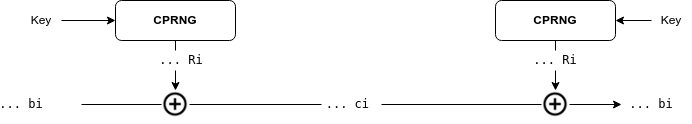
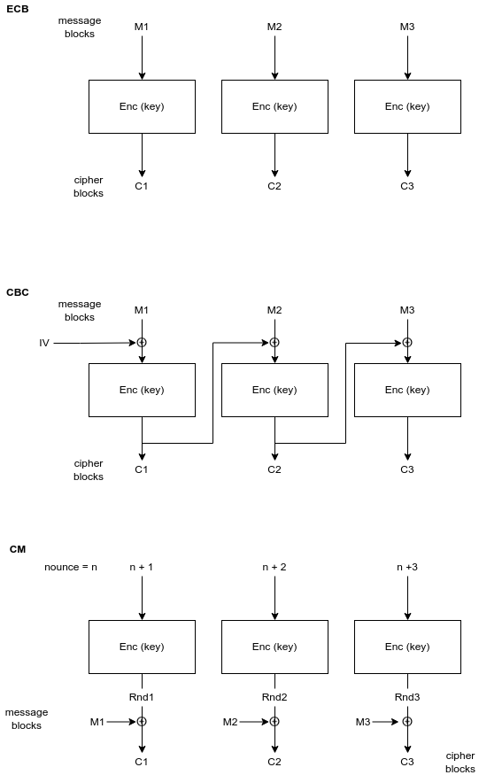

TOdo: https://rakhesh.com/infrastructure/notes-on-cryptography-ciphers-rsa-dsa-aes-rc4-ecc-ecdsa-sha-and-so-on/


# Cryptography 4 Developers

1. [Concepts](#concepts)
2. [Mathematics](#mathematics)
3. [Random Numbers](#random-numbers)
4. [Hash Functions](#hash-functions)
5. [Ciphers](#ciphers)<br>
   4.1. Symmetric<br>
   4.2. Asymmetric<br>
6. [TLS](#tlsssl)

Presentation material for a rapid fire lecture on cryptography for developers.


---

# Concepts

Modern cryptography has the following four main goals:

* The data is confidential and can be read-only by authorized persons
* The data cannot be changed during transmission or storage without this being noticeable
* Both the sender and the recipient can confirm each other as the originator or destination of the information
* The authorship of the message can not be disputed afterward
  
<br>

| Principle | Explanation | Example/Comment |
| --------- | ------------------------------------ | ---------------------------------- |
| **Privacy**<br>..the envelope | Privacy is the freedom, and basic human right, to live your life unobserved and unrecorded, and underpins safety and security of citizens within the state. | "WIthout encryption all privacy is lost " - Edward Snowden, |
| **Non Repudiation**<br>.. the originating post mark | Repudiation provides a purveyor of data to claim that the data in question did not originate with them (or was maliciously changed in transit. Non-repudiation is a guarantee (normally mathematically) that this was not possible. | Non-repudiation is particularly important in financial and legal transaction when once originated, the originator should not be able to "weasel out" of their obligations by claiming they never contracted to them. |
| **Confidentiality**<br>...the seal on the envelope | A secret is something that is only known to those to whom it has been revealed.  Confidentiality is achieved when access to something is kept secret. | Confidentiality can extend beyond the contents of the data to encompass both the sender and receiver, and in this form is known as Anonymity. |
| **Integrity**<br>..the impressed wax across the seal | Data integrity is maintained when it can be conclusively proven that the data has not been maliciously or otherwise changed unbeknownst to the user/keepers of that data. | If it changed the parties should know.  Integrity does not guarantee delivery.  |
| **Forward Secrecy**<br>..the old letters are always kept safe  | Unless the guarantee of secrecy is not just for data exchanged now but for all data exchanged in the past, a mechanism cannot be said to provide **perfect** forward secrecy. | Inappropriate application of cryptography such as re-using an ephemeral EC key could result in the revelation of secrets previously held through historic key compromise. |

---
References:
* https://simplicable.com/new/privacy-examples

---
# Mathematics

As a developer you will mostly just be using libraries provided in your programming language but there are some aspects of mathematics that will help you build a better conceptual framework when working with cryptographic libraries.

## XOR

All computer science students learn the basic bitwise operations, and `xor` is the one operation that is at the heart of much of cryptography because of the its reversability property `((a xor b) xor a)` is equal to  `b`.

**XOR Truth Table**
| A | B | A &#8853; B |
|:---:|:---:|:----------:|
| 0 | 1 | 1 |
| 0 | 0 | 0 |
| 1 | 1 | 0 |
| 1 | 0 | 1 |
| | | |

Quick example:
 1011 &#8853; 1101 = 0110, and 0110 &#8853; 1011 = 1101

## Modula Mathematics

Modular mathematics is the other piece of amazingly simple mathematics that is used everywhere in cryptography, and we recall it is the mathematics of integer division and integer remainders

a mod n &#8801; c

eg 5 mod 2 &#8801; the integer remainder after dividing integer 5 by integer 2 ie  5 mod 2 &#8801; 1

This sort of mathematics is one of ways that secure one way functions are created which may be used in hashing and signing operations.

## Prime Numbers

_to be continued_
* properties of primes
* factoring of primes

## Elliptic Curves

_to be continued_
* basic concepts
* curve parameters & generators
* curve operations of `addition` & `multiplication` on the curve

---

# Random Numbers

> **PRNG** (Pseudo Random Numbers)<br><br>
Linux offers the two files `/dev/random` & `/dev/urandom` for blocking & non-blocking random number generation.  Both rely on **CSPRNG** (cryptographically-secure pseudo-random number generator) in the Linux Kernel.<br><br>

```bash
dd if=/dev/urandom count=4 bs=1 of=rndint
od -An --format=dI rndint #display as a long integer
```
`openssl` includes a random function `rand` and allows for formatting in hex or base64, which may be utilised to generate random numbers for use as IV's, seeds etc, for example in CI pipelines or as required.

```bash
openssl rand -base64 10 | base64 --decode
openssl rand -hex 20 | xxd
openssl rand -hex 20 -out rndfile.hex
```

For interest you can quickly generate random words from a word dictionary in Linux as this example shows. This is useful for creating Plain Text files for testing encryption & decryption.

```bash
base64 /dev/urandom | head -c 1000 > random.txt
shuf -n 100 /usr/share/dict/words | fmt -w 72
```

Not to be out done, the BASH shell has `$RANDOM` env variable which uses `/dev/urandom` in the background.  Lets roll some dice!

```bash
$ cat dice.sh
#!/bin/bash

function roll_dice {
    min=1
    max=6
    number=$(expr $min + $RANDOM % $max)
    echo $number
}
```

Since the reversibility of most cryptographic mechanisms depend on the use of truly random number to work, the field of **random numbers** is a critical one to modern cryptography.  The stochastic decay of radioactive atoms and other hardware based sources of random numbers are considered the very best sources of random numbers.

References:
* https://www.schneier.com/blog/archives/2011/01/sony_ps3_securi.html
* https://www.design-reuse.com/articles/27050/true-randomness-in-cryptography.html

---

# Hash Functions
A hash function, otherwise known as a [one-way function](https://cryptography.fandom.com/wiki/One-way_function), takes an arbitrary message of arbitrary length and creates an output (a hash) of a fixed length. The main characteristics of a cryptographic hash function are that given a message, it is easy to compute the hash; given the hash, it is difficult to compute the message; and that given a message, it is difficult to find a different message that would produce the same hash (this is known as a collision)
Hash functions are used for data integrity and often in combination with digital signatures. With a good hash function, even a 1-bit change in a message will produce a different hash (on average, half of the bits change). With digital signatures, a message is hashed and then the hash itself is signed. The signature will show if the hash value has been tampered with and the hash will show if the message has been modified. The two types of hash functions are unkeyed (MD5, SHA-1) and keyed (MAC).
> Extract from Encyclopedia of Information Systems, Jeff Gilchrist, 2003
> 
<br>

## md5sum
> md5 - is not used much for cryptographically secure operations anymore but it is still useful to very quickly determine if files have changed

```
# to recursively create a list of md5 hashes 
md5sum * */* 2>/dev/null > files.md5

# to check the list of hashes
md5sum -c files.md5
```

## sha256sum
> Generate and verify SHA256 hashes at the CLI

```
cat cryptography.puml | sha256sum > cryptography.sha256
cat cryptography.puml | sha256sum -c cryptography.sha256 
```

## HMAC


Hash-based Message Authentication Code is a Keyed-hash Message Authentication Code(MAC) and is a type of hash that includes ensures Integrity (as may other forms of hashing) but also Authenticity (through the exchange of key).

`echo -n "value-to-digest" | openssl dgst -sha256 -hmac "secret-key-here" -binary | openssl enc -base64 -A`


References:
* https://en.wikipedia.org/wiki/Message_authentication_code
* https://cryptography.fandom.com/wiki/One-way_function
---
# Ciphers

## Concepts

### Stream Cipher



### Feistel
<br>
**Feistel Encryption**


> Exercise: do a small worked example and see how the &#8853; (xor) operator ensures that the process is reversible no matter how many iterations are performed.  Notice that F is any keyed one way function much like an HMAC.  A Feistel cipher approach is utilised for example by the Data Encryption Standard (DES) with other operations. 

**Feistel Decryption**


> It is interesting to note that AES (outside the scope of this introduction) uses a 2 dimensional array of bits to represent it's function F, which allows for column & row sifts, shuffles and substitution operations, making for an incredibly difficult F to break. 

References:
* https://www.youtube.com/watch?v=FGhj3CGxl8I
 


## Symmetric Ciphers

### Modes of Operation



| Mode | Name | Description |
| ------- | ----------------- | ------------------------------- |
| ECB | Electronic Code Book| |
| CBC | Cyclic Block Chaining| |
| CM/GCM | Galois Counter Mode | |
| | | |


### Common Symmetric Ciphers

### Encryption and Decryption


```bash
openssl enc -aes-256-cbc -pbkdf2 -in plain.txt -out encrypted.bin
openssl enc -d -aes-256-cbc -pbkdf2 -in encrypted.bin
```

```bash
echo "fox" | openssl enc -aes-256-cbc -a -pbkdf2 -md sha256 > encrypted.b64
cat encrypted.b64 | openssl enc -aes-256-cbc -a -md sha256 -pbkdf2 -d
```


## Asymmetric Ciphers

## TLS/SSL

We will use `openssl` to inspect the the TLS/SSL server connectivity

```
openssl s_client -connect teamfu.tech:443
openssl s_client -connect teamfu.tech:443 --showcerts
openssl s_client -connect teamfu.tech:443 -tls1_3
openssl ciphers -v
openssl s_client -connect teamfu.tech:443 -tls1_3 -ciphersuites 'TLS_CHACHA20_POLY1305_SHA256'
echo -n | openssl s_client -connect teamfu.tech:443 | sed -ne '/-BEGIN CERTIFICATE-/,/-END CERTIFICATE-/p' > cert.pem
openssl x509 -in cert.pem -text -noout
```

## Useful Linux commands


### GPG

> GNU Privacy Guard (Pretty Good Privacy on Windows)

Both Alice and Robert (we cannot use Bob as it is too short a name for GPG) each generate their own set of GPG keys.
```
# Create GPG Keyring
gpg --homedir . --list-keys

# Create a GPG Key pair
gpg --homedir . --generate-key
gpg --homedir . --full-generate-key

gpg --homedir . --list-keys

# Share our public key with our friend Robert
gpg --homedir . --user Alice --armor --export Alice  > Robert/alice.public.key

# Robert shares his key with Alice
gpg --homedir . --armor --user Robert --export Alice  > Alice/robert.public.key

# They each import each other's public key
gpg --homedir . --import {friend}.public.key

# and they each edit the imported key to `trust` it
gpg --homedir . --edit-key Alice
> trust
> 5
> quit

# friend encrypts a file to us
echo "super secrete message from Alice to Bob (robert) dear..." > message.txt
gpg --homedir . --output cyphertext.gpg --encrypt --local-user Alice --recipient Robert plain.txt

# Robert decrypts the message/file from his friend Alice
gpg --homedir .  --local-user Bobby --decrypt cyphertext.gpg

```

> pgp key servers are used to share public keys based on your email address. Try https://github.com/hockeypuck/hockeypuck if you want to host your own keyserver for your friends. PGP/GPG has a problem with fake public keys and fake signatures of real public keys... this is a fundamental problem with RSA public key cryptography...

Other operations of interest are `--sign`, `--verify` , `detach-sig`, `--edit-key`, `revkey`, `revsig`, 

> Git SIgned Commits: https://git-scm.com/book/en/v2/Git-Tools-Signing-Your-Work<br>This can imrpove your git security but it requires all contributors to sign and makes gitflow a bit more cumbersome.

---

### Certificate Authorities

> Story of CryptoAG: https://www.theguardian.com/us-news/2020/feb/11/crypto-ag-cia-bnd-germany-intelligence-report


#### Self Signed Certificates
> Self-signed certificates are useful for testing and development environments but not suitable for production environments.

Lets assume we are generating one for our nginx webserver.  We need to start by generating a CSR (Certificate Signing Request).  Then using a trusted key ("CA") we use the CSR to generate a CRT which we then can load into our webserver to be used to validate the authenticity of the server.  `openssl` allows developers to do all these in one step:

```
sudo openssl req -x509 -nodes -days 365 -newkey rsa:2048 -keyout /etc/ssl/private/nginx-selfsigned.key -out /etc/ssl/certs/nginx-selfsigned.crt
```

Notes:

- openssl: This is the basic command line tool for creating and managing OpenSSL certificates, keys, and other files.
req: This subcommand specifies that we want to use X.509 certificate signing request (CSR) management. The “X.509” is a public key infrastructure standard that SSL and TLS adheres to for its key and certificate management. We want to create a new X.509 cert, so we are using this subcommand.

- x509: This further modifies the previous subcommand by telling the utility that we want to make a self-signed certificate instead of generating a certificate signing request, as would normally happen.

- nodes: This tells OpenSSL to skip the option to secure our certificate with a passphrase. We need Nginx to be able to read the file, without user intervention, when the server starts up. A passphrase would prevent this from happening because we would have to enter it after every restart.

- days 365: This option sets the length of time that the certificate will be considered valid. We set it for one year here.

- newkey rsa:2048: This specifies that we want to generate a new certificate and a new key at the same time. We did not create the key that is required to sign the certificate in a previous step, so we need to create it along with the certificate. The rsa:2048 portion tells it to make an RSA key that is 2048 bits long.

- keyout: This line tells OpenSSL where to place the generated private key file that we are creating.

- out: This tells OpenSSL where to place the certificate that we are creating.

Web servers need to ensure that the current exchange between client and server cannot be used to compromise previous exchanges - this is known as Forward Secrecy and the webserver uses Diffie-Hellman mathematical wizardry to achieve this.  We generate a strong DH group for our webserver with:
```
sudo openssl dhparam -out /etc/ssl/certs/dhparam.pem 2048
```

For those interested in the contents of the self-signed certificate and the RSA key generated:
```
openssl x509 -in nginx-selfsigned.crt -text -noout
openssl rsa -in nginx-selfsigned.key -text -noout
```


---

### RSA (Rivest,Shamir,Adleman) Encryption

> for now see the Jupyter notebook called [rsa](rsa.ipynb)
References:
- https://thatsmaths.com/2016/08/11/a-toy-example-of-rsa-encryption/


## File Formats

**PEM** is container format in which we may hold a X.509 certificate (whose structure is defined using ASN.1), encoded using the ASN.1 DER (distinguished encoding rules), then run through Base64 encoding and stuck between plain-text anchor lines (BEGIN CERTIFICATE and END CERTIFICATE).

* To convert a DER file (.crt .cer .der) to PEM: `openssl x509 -inform der -in cert.cer -out cert.pem`.
* To convert a PEM file to DER: `openssl x509 -outform der -in cert.pem -out certi.der`. 
* To convert a PKCS#12 file (.pfx .p12) containing a private key and certificates to PEM: `openssl pkcs12 -in keyStore.pfx -out keyStore.pem -nodes`. 
* To convert a PEM certificate file and a private key to PKCS#12 (.pfx .p12): `openssl pkcs12 -export -out cert.pfx -inkey privateKey.key -in cert.crt -certfile CACert.crt`
* PKCS#7 is an open standard used by Java and supported by Windows. It does not contain private key material.


# ECC

References:
- https://onyb.gitbook.io/secp256k1-python/introduction
- https://pypi.org/project/ecdsa/

---
General References:
* https://cryptobook.nakov.com/
* https://allabouttesting.org/5-must-know-concepts-in-cryptography/
* https://crypto.stanford.edu/cs155old/cs155-spring03/lecture8.pdf
---
Licensed under [Creative Commons Zero (CC)](./LICENSE)<br> 
Copyright &copy; 2022, Cyber-Mint (Pty) Ltd