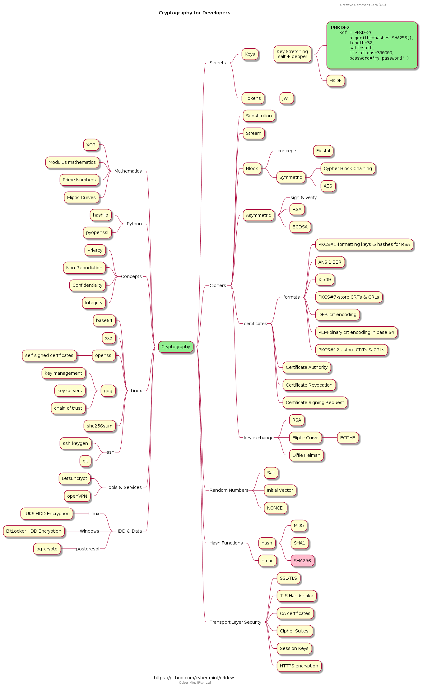

# Cryptography 4 Developers

Presentation material for a rapid fire lecture on cryptography for developers.



## Random Numbers

> **PRNG** (Pseudo Random Numbers)<br><br>
Linux offers the two files `/dev/random` & `/dev/urandom` for blocking & non-blocking random number generation.  Both rely on **CSPRNG** (cryptographically-secure pseudo-random number generator) in the Linux Kernel.<br><br>

```bash
dd if=/dev/urandom count=4 bs=1 of=rndint
od -An --format=dI rndint #display as a long integer
```
`openssl` includes a random function `rand` and allows for formatting in hex or base64, which may be utilised to generate random numbers for use as IV's, seeds etc, for example in CI pipelines or as required.

```bash
openssl rand -base64 10 | base64 --decode
openssl rand -hex 20 | xxd
openssl rand -hex 20 -out rndfile.hex
```

For interest you can quickly generate random words from a word dictionary in Linux as this example shows. This is useful for creating Plain Text files for testing encryption & decryption.

```bash
base64 /dev/urandom | head -c 1000 > random.txt
shuf -n 100 /usr/share/dict/words | fmt -w 72
```

Not to be out done, the BASH shell has `$RANDOM` env variable which uses `/dev/urandom` in the background.  Lets roll some dice!

```bash
$ cat dice.sh
#!/bin/bash

function roll_dice {
    min=1
    max=6
    number=$(expr $min + $RANDOM % $max)
    echo $number
}
```

## Encryption and Decryption


```bash
openssl enc -aes-256-cbc -pbkdf2 -in plain.txt -out encrypted.bin
openssl enc -d -aes-256-cbc -pbkdf2 -in encrypted.bin
```

```bash
echo "fox" | openssl enc -aes-256-cbc -a -pbkdf2 -md sha256 > encrypted.b64
cat encrypted.b64 | openssl enc -aes-256-cbc -a -md sha256 -pbkdf2 -d
```

## TLS/SSL

We will use `openssl` to inspect the the TLS/SSL server connectivity

```
openssl s_client -connect teamfu.tech:443
openssl s_client -connect teamfu.tech:443 --showcerts
openssl s_client -connect teamfu.tech:443 -tls1_3
openssl ciphers -v
openssl s_client -connect teamfu.tech:443 -tls1_3 -ciphersuites 'TLS_CHACHA20_POLY1305_SHA256'
echo -n | openssl s_client -connect teamfu.tech:443 | sed -ne '/-BEGIN CERTIFICATE-/,/-END CERTIFICATE-/p' > cert.pem
openssl x509 -in cert.pem -text -noout
```

## Useful Linux commands

**md5sum**
> md5 - is not used much for cryptographically secure operations anymore but it is still useful to very quickly determine if files have changed

```
# to recursively create a list of md5 hashes 
md5sum * */* 2>/dev/null > files.md5

# to check the list of hashes
md5sum -c files.md5
```

**sha256sum**
> Generate and verify SHA256 hashes at the CLI

```
cat cryptography.puml | sha256sum > cryptography.sha256
cat cryptography.puml | sha256sum -c cryptography.sha256 
```

### GPG

> GNU Privacy Guard (Pretty Good Privacy on Windows)

Both Alice and Robert (we cannot use Bob as it is too short a name for GPG) each generate their own set of GPG keys.
```
# Create GPG Keyring
gpg --homedir . --list-keys

# Create a GPG Key pair
gpg --homedir . --generate-key
gpg --homedir . --full-generate-key

gpg --homedir . --list-keys

# Share our public key with our friend Robert
gpg --homedir . --user Alice --armor --export Alice  > Robert/alice.public.key

# Robert shares his key with Alice
gpg --homedir . --armor --user Robert --export Alice  > Alice/robert.public.key

# They each import each other's public key
gpg --homedir . --import {friend}.public.key

# and they each edit the imported key to `trust` it
gpg --homedir . --edit-key Alice
> trust
> 5
> quit

# friend encrypts a file to us
echo "super secrete message from Alice to Bob (robert) dear..." > message.txt
gpg --homedir . --output cyphertext.gpg --encrypt --local-user Alice --recipient Robert plain.txt

# Robert decrypts the message/file from his friend Alice
gpg --homedir .  --local-user Bobby --decrypt cyphertext.gpg

```

> pgp key servers are used to share public keys based on your email address. Try https://github.com/hockeypuck/hockeypuck if you want to host your own keyserver for your friends. PGP/GPG has a problem with fake public keys and fake signatures of real public keys... this is a fundamental problem with RSA public key cryptography...

Other operations of interest are `--sign`, `--verify` , `detach-sig`, `--edit-key`, `revkey`, `revsig`, 

> Git SIgned Commits: https://git-scm.com/book/en/v2/Git-Tools-Signing-Your-Work<br>This can imrpove your git security but it requires all contributors to sign and makes gitflow a bit more cumbersome.

---

### Certificate Authorities

> Story of CryptoAG: https://www.theguardian.com/us-news/2020/feb/11/crypto-ag-cia-bnd-germany-intelligence-report


#### Self Signed Certificates
> Self-signed certificates are useful for testing and development environments but not suitable for production environments.

Lets assume we are generating one for our nginx webserver.  We need to start by generating a CSR (Certificate Signing Request).  Then using a trusted key ("CA") we use the CSR to generate a CRT which we then can load into our webserver to be used to validate the authenticity of the server.  `openssl` allows developers to do all these in one step:

```
sudo openssl req -x509 -nodes -days 365 -newkey rsa:2048 -keyout /etc/ssl/private/nginx-selfsigned.key -out /etc/ssl/certs/nginx-selfsigned.crt
```

Notes:

- openssl: This is the basic command line tool for creating and managing OpenSSL certificates, keys, and other files.
req: This subcommand specifies that we want to use X.509 certificate signing request (CSR) management. The “X.509” is a public key infrastructure standard that SSL and TLS adheres to for its key and certificate management. We want to create a new X.509 cert, so we are using this subcommand.

- x509: This further modifies the previous subcommand by telling the utility that we want to make a self-signed certificate instead of generating a certificate signing request, as would normally happen.

- nodes: This tells OpenSSL to skip the option to secure our certificate with a passphrase. We need Nginx to be able to read the file, without user intervention, when the server starts up. A passphrase would prevent this from happening because we would have to enter it after every restart.

- days 365: This option sets the length of time that the certificate will be considered valid. We set it for one year here.

- newkey rsa:2048: This specifies that we want to generate a new certificate and a new key at the same time. We did not create the key that is required to sign the certificate in a previous step, so we need to create it along with the certificate. The rsa:2048 portion tells it to make an RSA key that is 2048 bits long.

- keyout: This line tells OpenSSL where to place the generated private key file that we are creating.

- out: This tells OpenSSL where to place the certificate that we are creating.

Web servers need to ensure that the current exchange between client and server cannot be used to compromise previous exchanges - this is known as Forward Secrecy and the webserver uses Diffie-Hellman mathematical wizardry to achieve this.  We generate a strong DH group for our webserver with:
```
sudo openssl dhparam -out /etc/ssl/certs/dhparam.pem 2048
```


---

### RSA (Rivest,Shamir,Adleman) Encryption

References:
- https://thatsmaths.com/2016/08/11/a-toy-example-of-rsa-encryption/

---
Licensed under [Creative Commons Zero (CC)](./LICENSE)<br> 
Copyright &copy; 2022, Cyber-Mint (Pty) Ltd